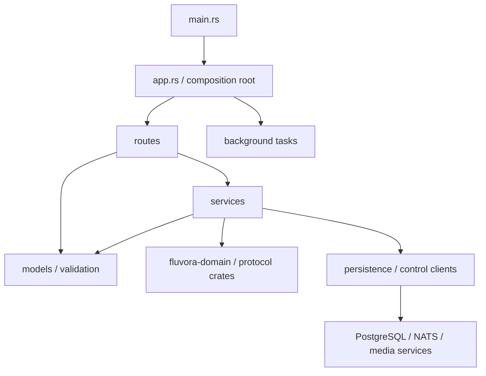
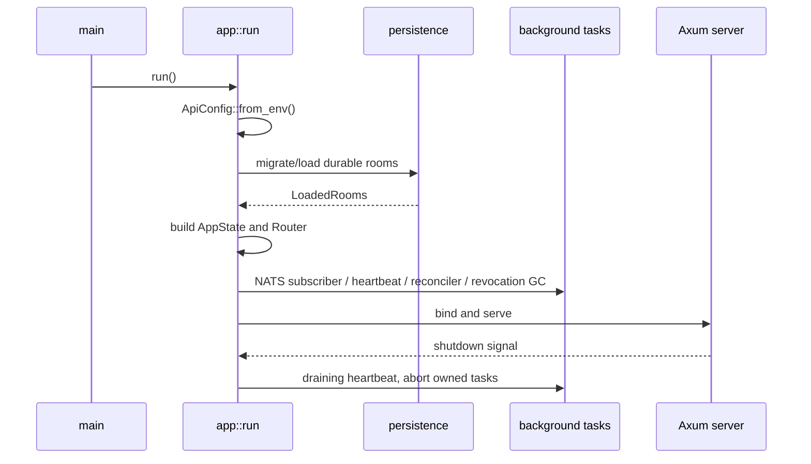
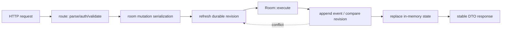
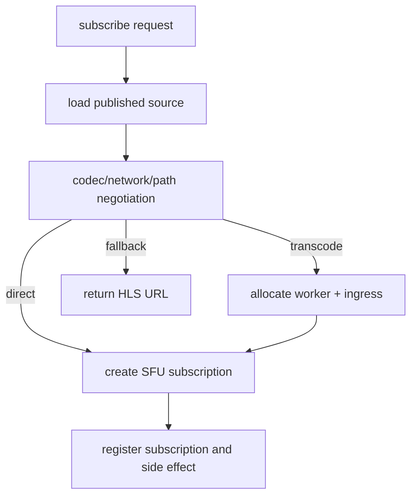

# API 服务内部设计

状态：已实现并由架构门禁约束  
适用范围：`crates/services/api-server`  
关联文档：[总体架构](ARCHITECTURE.md)、[代码库分层](LAYERS.md)、[公开 API](API.md)

## 1. 设计目标

`fluvora-api-server` 是控制面组合应用，不承载可复用协议状态机或媒体热路径。内部设计需要保证：

- HTTP、WebSocket、WHIP/WHEP 输入与业务编排分离；
- 房间领域规则只由 `fluvora-domain` 决定，API 不复制领域不变量；
- PostgreSQL、文件快照、NATS 和内部 HTTP 都通过明确的适配边界接入；
- 同一命令在重试、进程重启和多副本竞争下保持幂等；
- 状态锁的所有权清晰，不在同步锁持有期间执行异步 I/O；
- 新能力可以按 capability 扩展，不让 `main.rs` 或单个模块持续膨胀；
- 模块依赖和代码风格可由自动门禁验证，而不是依赖人工记忆。

非目标：

- API 服务不解析或转发 RTP/RTCP/SRTP 媒体包；
- API 服务不实现 FFmpeg 转码和 HLS 文件生成；
- API 服务不作为 SDK 类型定义的唯一来源，跨端契约仍由公开 API 和契约检查器约束。

## 2. 目录与职责

```text
src/
├── main.rs                     进程入口和模块声明
├── app.rs                      启动、依赖装配、路由、健康检查和关闭
├── runtime.rs                  时钟、随机数、标识符格式和关闭信号
├── models/
│   ├── state.rs                进程状态、注册表和有界缓存所有权
│   ├── rooms.rs                房间请求/响应 DTO
│   ├── signaling.rs            信令、事件票据和 ICE DTO
│   ├── webrtc.rs               SDP、WHIP/WHEP 会话 DTO
│   └── media.rs                轨道、订阅、转码和 worker DTO
├── routes/
│   ├── rooms.rs                房间、角色、聊天、礼物和发布 HTTP 适配
│   ├── signaling.rs            P2P 信令、WebSocket 事件和 ICE 适配
│   ├── webrtc.rs               SDP、WHIP 和 WHEP 适配
│   └── media.rs                轨道与订阅 HTTP 适配
├── services/
│   ├── room_commands.rs        鉴权、幂等、领域命令和副作用记录
│   ├── room_state.rs           持久房间刷新和内存状态替换
│   ├── media_sessions.rs       media-node 会话预配和会话授权
│   └── media_orchestration.rs  direct/transcode/HLS 媒体路径编排
├── config.rs                   环境变量解析和启动期校验
├── error.rs                    稳定错误码与 HTTP 响应映射
├── persistence.rs              PostgreSQL/文件持久化和恢复
├── control_client.rs           内部服务 HTTP、placement 和有界响应
├── gateway_client.rs           media-gateway 代理契约
├── gateway_routes.rs           资产与直播控制面路由
├── protocol.rs                 WHIP/WHEP、ETag 和 Trickle ICE 边界
├── signals.rs                  信令持久化、分页和有界缓存
├── validation.rs               无副作用输入解析和边界校验
├── gift.rs                     礼物回执校验
└── transcode_reconciler.rs     实时转码探测、恢复和 fencing 清理
```

`main.rs` 只调用 `app::run()`。新增依赖、路由或后台任务都在 `app.rs` 组合，具体行为必须落到对应
capability 或适配器模块。

## 3. 依赖方向



允许的方向：

| 来源 | 可以依赖 | 不应依赖 |
|---|---|---|
| `main.rs` | `app` | 路由、领域、数据库和内部客户端细节 |
| `app.rs` | 配置、路由、后台任务、状态和适配器 | 具体请求业务分支 |
| `routes` | DTO、校验、应用服务、稳定错误 | 数据库 SQL、NATS 细节、媒体协议状态机 |
| `services` | 领域、状态、持久化和内部服务适配器 | Axum 路由注册、SDK 实现 |
| `models` | 标准类型和共享 crate 类型 | 路由函数、I/O 工作流 |
| 基础设施适配器 | 错误、状态、外部 crate | 具体 HTTP handler |

同级 capability 可以通过精确的兄弟模块路径复用私有实现。根模块统一使用 `crate::` 路径，避免
依赖 `main.rs` 中的隐式重导出。

## 4. 启动与关闭



启动失败采用 fail-fast：无效密钥、端点、DTLS fingerprint、数据库连接或快照恢复错误会阻止进程
进入 ready。`/health/live` 只表示进程存活；`/health/ready` 同时检查内部媒体服务、gateway、worker、
持久化和事件总线状态。

## 5. 请求处理模型

### 5.1 房间命令



`execute_room_command` 是房间变更的统一入口：

1. 路由验证 token scope、房间约束和 `Idempotency-Key`；
2. 应用服务串行化本进程内房间写入；
3. PostgreSQL 模式先刷新当前 revision；
4. `Room::execute` 校验领域规则并生成领域事件；
5. 持久层以 expected revision 追加，区分 applied、duplicate 和 conflict；
6. applied 后才替换内存状态；conflict 使用相同命令最多重试有限次数；
7. duplicate 返回当前 sequence，不重复执行领域事件。

调用 media-node、worker 或 gateway 的副作用命令使用独立副作用记录，确保客户端使用同一幂等键
重试时不会重复创建资源。

### 5.2 媒体订阅



转码工作流通过 `TranscodeWorkerRequest` 聚合相关输入，避免长参数列表。任何一步失败都按逆序清理
worker placement、transcode ingress 和 recording sink；generation fencing 防止旧任务删除新 owner。

### 5.3 信令与事件

- PostgreSQL 模式将信令写入 durable signal stream，再更新本地有界缓存；
- 文件模式在房间快照状态中维护相同语义的序列号和幂等记录；
- 每房间缓存同时限制条目数量与编码字节数；
- WebSocket 先回放 `after` 游标后的可见事件，再订阅 broadcast；
- broadcast lag 返回 `system.resync_required`，客户端必须从 REST 分页恢复；
- WebSocket 事件票据短期、单次使用，并绑定 room 和 participant。

## 6. 状态与并发所有权

`AppState` 只保存跨请求共享且生命周期与进程一致的资源：

| 状态 | 同步方式 | 规则 |
|---|---|---|
| rooms、tracks、subscriptions、sessions | `std::sync::RwLock` | 临界区只做内存操作，不跨 `.await` |
| room mutations | `tokio::sync::Mutex` | 串行化持久房间写入和 revision 竞争 |
| protocol updates | `tokio::sync::Mutex` | 串行化 WHIP/WHEP 会话更新 |
| transcode registry | `tokio::sync::Mutex` | 原子维护 coordinator、引用计数和 active job |
| event channels | `RwLock<HashMap<...>>` | sender 存于状态，receiver 归 WebSocket 任务所有 |
| HTTP client、token ring、配置 | `Arc` | 初始化后只读复用 |

同步锁中只能复制或替换小型状态。数据库、NATS 和内部 HTTP I/O 必须在锁外执行；确需跨异步步骤
保持一致性时使用专用异步 mutex，并保持锁顺序稳定。

## 7. 持久化与一致性

API 支持两种持久化后端：

- PostgreSQL：生产基线，使用 revision compare-and-append、命令幂等、signal stream、outbox 和
  placement；
- 文件快照：本地和单实例回退，使用同目录临时文件、同步落盘、原子替换和双版本恢复。

内存状态是服务当前视图，不是最终事实来源。多副本下以 PostgreSQL revision 和 generation 为准；
NATS 事件用于刷新其他副本，不能替代数据库提交。事件 schema 版本不兼容时服务拒绝应用该事件，
并保持 readiness/日志可观测。

## 8. 错误与安全边界

- 对外错误使用稳定 `code` 和经过清理的 `message`，不泄漏内部 URL、文件路径和凭据；
- 鉴权先校验 token，再校验 scope、room binding、成员身份和资源所有权；
- JSON、SDP、Trickle ICE、信令、上传块和内部响应都有独立大小上限；
- 内部 HTTP 客户端不跟随重定向，只接受经过结构校验的 HTTP(S) origin 和绝对路径；
- gateway 业务 4xx 可以透传稳定 JSON，重定向、非法内容和上游 5xx 映射为受控错误；
- 礼物事件只能由可信回执验签路径产生；客户端不能经 DataChannel 伪造；
- 日志允许记录内部错误原因，但不得记录 token、媒体 payload、DTLS/SRTP key。

## 9. 新能力落位流程

新增公开能力时按以下顺序实现：

1. 在 `models/<capability>.rs` 增加有界 DTO；
2. 在 `validation.rs` 或 capability 私有函数中增加无副作用校验；
3. 在 `services` 增加用例编排，或复用现有领域命令；
4. 在 `routes/<capability>.rs` 增加薄 handler；
5. 在 `app.rs` 注册路由和 body limit；
6. 同步 `docs/API.md` 与 `docs/sdk-contract-v1.json`；
7. 为幂等、权限、大小边界、失败清理和恢复路径补测试；
8. 运行架构检查、Clippy、单元测试和 full release gates。

如果 capability 接近行数预算，应按用例继续拆分，而不是提高预算或把逻辑移回 `app.rs`。

## 10. 代码风格约束

- 导入分为标准库、外部 crate、内部模块三组；
- 内部依赖从定义它的模块显式导入，生产代码禁止 `crate::*` 和顶层 `super::*`；
- 根级模块使用 `crate::`，子目录内兄弟模块使用精确 `super::<module>`；
- 相关参数超过合理数量时建立 request/context 类型，不压制 `clippy::too_many_arguments`；
- 错误码使用稳定 `snake_case`，标识符格式化统一调用 `runtime::format_id`；
- `rustfmt.toml` 是 Rust 排版规范，`.editorconfig` 统一跨语言编码、缩进和行尾。

## 11. 自动约束与验证

`scripts/check-architecture.ps1` 当前验证：

- `main.rs` 不超过 40 行；
- 15 个核心 API 模块不超过各自 focused-module 预算；
- 30 个 API Rust 源文件不存在生产通配导入；
- 根模块不使用顶层 `super::` 路径；
- 不使用 `clippy::too_many_arguments` 豁免；
- workspace crate 依赖方向和目录归属正确。

本地最小验证：

```powershell
powershell -NoProfile -ExecutionPolicy Bypass -File scripts/check-architecture.ps1
cargo fmt --all -- --check
cargo clippy -p fluvora-api-server --all-targets -- -D warnings
cargo test -p fluvora-api-server
node scripts/check-sdk-contract.mjs
```

发布前运行：

```powershell
powershell -NoProfile -ExecutionPolicy Bypass -File scripts/run-release-gates.ps1 -Profile full
```
