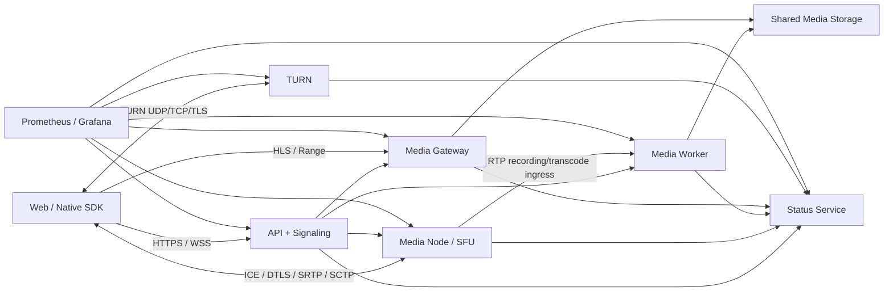

# Fluvora 架构设计

[简体中文](ARCHITECTURE.md) | [English](en/ARCHITECTURE.md)

状态：Production Candidate v1（自动门禁已实现，真实基础设施认证见验收文档）  
项目名：Fluvora（澜曜）  
后端：Rust 2024 Edition

## 1. 目标和边界

Fluvora 用同一套控制面支持四种媒体模式，但不强迫它们共用同一数据路径。

| 模式 | 数据路径 | 典型目标 |
|---|---|---|
| WebRTC P2P | 客户端直连，失败时经 Fluvora TURN | 1 对 1、低成本 |
| WebRTC SFU | 发布者 → media-node → 订阅者 | 多人通话、互动直播 |
| 直播 | WebRTC 轨道 → worker → CMAF/HLS | 大规模观看、CDN 分发 |
| 点播 | 分块上传 → 探测/转码 → HLS/HTTP Range | 录播、媒资播放 |

不使用 `webrtc-rs`、Pion、mediasoup、Janus、LiveKit、coturn 等现成
WebRTC/SFU/TURN 服务器核心。自主实现的协议面包括：

- 有界字节编解码、STUN、ICE-lite、SDP；
- DTLS 会话驱动、SRTP 密钥导出和 SRTP/SRTCP 上下文；
- RTP/RTCP、NACK、PLI、报告和 Transport-CC；
- SFU 路由、序号/时间戳/SSRC/扩展重写和层选择；
- TURN UDP、TCP、TLS、权限、ChannelData、nonce 和 REST credential；
- SCTP common header、CRC32C、INIT/cookie、DATA/SACK、重排、分片和重传；
- DCEP OPEN/ACK、WebRTC PPID、RFC 3758 PR-SCTP/FORWARD-TSN 和 RFC 6525 stream reset。

OpenSSL 仅承担经过审计的 DTLS/证书/ECDHE 密码原语；FFmpeg 仅承担编解码、探测、
转码和封装。实时 SFU 转发不经过 FFmpeg。

## 2. 运行拓扑

当前 Kubernetes 基线使用共享 PostgreSQL 保存房间事件、幂等记录、outbox、任务归属和租约，
使用 NATS JetStream 分发事件，使用 S3 兼容对象存储保存媒资。API、status、dispatcher 和
worker 可多副本运行；调度使用 lease、generation fencing 与故障接管避免旧 owner 回写。
media-node、TURN 和 gateway 按数据面 shard 独立部署，基线每 shard 一个副本；横向扩展时为
每个 shard 分配独立 UDP/host port、节点标识和一致性路由，不能让多个实例争用同一媒体端口。

## 3. 服务职责

| 服务 | 默认端口 | 职责 |
|---|---:|---|
| `fluvora-api-server` | 8080/TCP | 鉴权、房间、信令、WHIP/WHEP、轨道、互动数据、任务编排 |
| `fluvora-status-service` | 8090/TCP | 五类服务心跳、容量和平台状态 |
| `fluvora-media-worker` | 8091/TCP | FFmpeg 点播、直播和实时 RTP 转码任务 |
| `fluvora-media-node` | 8092/TCP、50000/UDP | ICE/DTLS/SRTP/SCTP、SFU 和 RTP 数据面 |
| `fluvora-media-gateway` | 8093/TCP | 媒资上传、元数据、HLS/CMAF/Range 分发 |
| `fluvora-turn-server` | 3478、5349、8094 | TURN/STUN、relay 数据和监控 |
| `fluvora-admin` | CLI | 从服务端密钥签发有作用域、有限期访问令牌 |

内部控制接口全部使用独立 bearer token；心跳 token 与业务 token 隔离。静态配置和动态
placement 返回的端点必须是无凭据、无路径、无 query/fragment 的 HTTP(S) origin；
控制响应在流式读取过程中限制为 1 MiB，包括没有 `Content-Length` 的 chunked 响应。

## 4. WebRTC 会话

1. SDK 用短期 token 加入房间；
2. 浏览器创建媒体 transceiver 和可靠有序 `fluvora.room.v1` DataChannel；
3. SDK 生成完整 SDP offer 并提交 API；
4. API 校验 BUNDLE、ICE、fingerprint、codec、header extension 和媒体方向；
5. API 在 media-node 预配 ICE-lite 会话并返回 SDP answer；
6. media-node 校验 STUN MESSAGE-INTEGRITY，选定远端五元组；
7. OpenSSL DTLS server 校验证书 fingerprint，导出 SRTP key；
8. RTP/SRTP、RTCP/SRTCP 和 SCTP over DTLS 共用 BUNDLE transport；
9. ICE restart 在原资源 URL 内替换 ufrag/password 和地址索引，不泄漏旧 generation。

媒体节点使用单 UDP socket 分类 STUN、DTLS、RTP 和 RTCP。所有解析器都限制报文长度、
集合容量、重排窗口、重传窗口和重组消息大小。

## 5. SFU 与自适应

发布轨道包含一个或多个 encoding。订阅建立后 SFU 为每个 down-track 分配独立 SSRC、
RTP sequence、timestamp、payload type 和 header-extension rewrite 状态。

自适应输入：

- Transport-CC 到达时序和反馈；
- Receiver Report 丢包和 RTT；
- NACK、PLI 与关键帧到达；
- SDK 的 `RTCPeerConnection.getStats()`；
- 订阅者 codec、目标分辨率、帧率和码率。

决策顺序：

1. 音频优先，不因视频拥塞中断；
2. 对 Simulcast/SVC 使用滞回层切换；
3. 受限网络降低发送端编码预算；
4. codec 不兼容时启动实时转码 bridge；
5. 连续严重弱网时 SDK 可回退 HLS；
6. worker 任务终止后 API 自动重建任务、RTP sink 和关键帧请求。

直接转发、实时转码和 HLS fallback 使用同一个订阅决策响应，客户端能知道实际路径。

## 6. DataChannel 与房间数据

`fluvora.room.v1` 使用二进制 `Envelope v1`：

- magic/version/flags；
- kind；
- 128 位 room/sender；
- 64 位 room sequence 和 timestamp；
- 有界 payload。

完整 Envelope 上限为 16 KiB，包含 60 字节固定头部，因此应用 payload 上限为 16,324
字节。客户端编码、浏览器入站分配和服务端 SCTP 收发共享这一边界，避免头部未计入导致最大
帧无法回送。

客户端只能发送 Chat、Control 和 `0x8000..=0xffff` Custom。服务端拒绝伪造的 room/sender，
并写入权威 sender、单调 sequence 和 timestamp。Presence 和 Gift 只能由可信控制路径生成，
避免绕过成员权限或支付验证。

其他 DataChannel label 可在同一房间中转发不透明的字符串/二进制数据，用于业务扩展。
实现支持可靠有序/无序，以及限次重传和限时两类部分可靠通道。PR-SCTP 在 SCTP INIT
阶段协商，放弃粒度是完整用户消息；FORWARD-TSN 在累计 SACK 确认前按 RTO 重发，保证首包
丢失时被放弃的 TSN 仍不会永久阻塞后续消息。发送窗口同时约束未累计确认的 TSN 跨度，
对端不能通过持续 gap ACK 绕过内存上限。未协商时明确拒绝部分可靠 DCEP OPEN。

可靠业务记录仍走 REST/WSS 控制路径；DataChannel 是低延迟房间数据面。

## 7. P2P

P2P 模式的媒体不经过 SFU。API 保存有界信令 backlog，并支持 offer、answer、
ICE candidate、ICE restart、renegotiate 和 bye。短期 TURN REST credential 由 API 签发，
客户端优先 host/srflx candidate，失败后使用 TURN。

## 8. 直播与点播

直播：

- WebRTC 已发布轨道可以绑定 worker RTP ingress；
- worker 可并行生成最多 8 档 rendition 的 CMAF init、滚动 media segment、media
  playlist 和 master playlist；
- gateway 原子持久化元数据，重启后恢复 worker monitor；
- gateway 启动时校验快照文件名、内部 identity/revision、聚合状态、worker endpoint 和任务
  边界；损坏或超限的最新快照不会覆盖上一份有效版本；
- finish 写入 end-list，适合继续形成回放。

点播：

- 创建 asset；
- 有偏移校验的分块上传；
- complete 后用 ffprobe 探测；
- worker 生成多 rendition HLS；
- gateway 支持安全路径、Range、cache header 和跨域白名单。

所有外部 media ID、相对路径、上传大小、segment 大小和进程参数均做边界检查。

## 9. 监控与恢复

每个服务每 5 秒向 status service 上报：

- service、node、region、version；
- healthy/draining；
- room/session/track/job/asset/live/turn allocation 容量；
- 内存使用。

Prometheus 指标不使用 room/user/track 等高基数 label。默认告警覆盖：

- 服务或 media-node 不可用；
- 心跳丢失；
- RTP 丢包和认证失败升高；
- DataChannel 重传耗尽和部分可靠消息放弃量；
- TURN relay 端口压力；
- 转码任务失败累积。

Grafana 自动配置 Fluvora Overview。部署时应把 Alertmanager `default` receiver 替换为企业
邮件、PagerDuty、Slack 或其他值班通道。

## 10. 安全模型

- 业务 token 使用 HMAC-SHA256、固定二进制 claims、过期时间、nonce 和 scope；
- token secret 为 32..=4096 字节，内部 token 为 16..=4096 字节，均拒绝控制字符；
- DTLS fingerprint 必须与 media-node 证书匹配；
- SRTP/SRTCP 启用认证与 replay window；
- TURN 使用 long-term credential、短期 REST credential、绑定 IP 的 nonce；
- TURN 禁止 multicast、broadcast、unspecified 和不安全 peer；
- TURN allocation 同时受全局、来源 IP 和固定 relay 端口池限制；
- CORS 默认关闭，只允许显式 `FLUVORA_CORS_ORIGINS`；
- 内部端点和路径在发起请求前重新校验，拒绝 userinfo、scheme-relative 路径和重定向参数；
- 内部 HTTP 客户端不跟随重定向，并设置连接/请求超时；gateway 控制代理只接受有界 JSON
  或空响应，保留业务 4xx，将重定向和上游 5xx 映射为 502；
- 心跳和 placement 控制端点按 URL 结构解析，拒绝 userinfo/path/query/fragment；plain HTTP
  心跳仅允许精确 loopback，集群内 HTTP 必须显式确认隔离网络；
- API 房间快照、gateway 元数据和 worker assignment fence 使用同目录临时文件、`fsync`、
  原子 rename 与双版本保留；恢复时逐候选重新执行领域不变量校验；
- 实时转码故障恢复按 placement generation 清理失败尝试，过期清理不能删除更新后的 placement；
- 内部依赖、存储和控制面错误细节仅写服务日志，公网错误响应使用稳定、无路径信息的消息；
- 容器以非 root、`no-new-privileges` 运行；
- 日志和指标不输出 token、DTLS/SRTP key 或媒体 payload。

公网生产部署应在 API/gateway 前使用 TLS ingress，在 TURN/TLS 使用正式证书，并限制内部
控制端口只对服务网络开放。

## 11. 验证策略

- 单元测试：字节 codec、协议状态机、鉴权、房间、媒体和恢复；
- RFC 向量：STUN、SRTP、TURN；
- 集成测试：TURN UDP/TCP/TLS、SFU 路由、轨道清理、ICE restart；
- 真实进程测试：FFmpeg VP8 RTP → H264 RTP、MP4 → 多码率 fMP4/HLS、VP8/RTP → 直播 HLS；
- 模糊测试：STUN、RTP、SCTP/DataChannel；
- CI：fmt、严格 clippy、全 workspace test、OpenSSL 特性、Web SDK、容器镜像；
- 上线前：Chrome/Firefox/Safari 互通、netem 弱网、容量、48 小时 soak 和安全扫描。

## 12. 详细设计边界

本文保持系统级视角，不重复每个模块和公开字段。详细信息按下列文档分工：

- [代码分层](LAYERS.md)：workspace package 依赖方向和服务 crate 内部分层；
- [代码库总览](CODEBASE.md)：crate 职责、运行链路和新代码落位；
- [API 服务内部设计](API_SERVER_STRUCTURE.md)：请求链、并发所有权、持久化与错误边界；
- [公开 API](API.md)：HTTP、WebSocket、WHIP/WHEP 和媒体资源契约；
- [生产验收](PRODUCTION_ACCEPTANCE.md)：自动门禁与真实环境认证；
- [运维手册](RUNBOOK.md)：发布、回滚、备份、故障和安全事件处置。

文档阅读路径和更新触发条件统一维护在 [文档索引](README.md)。
