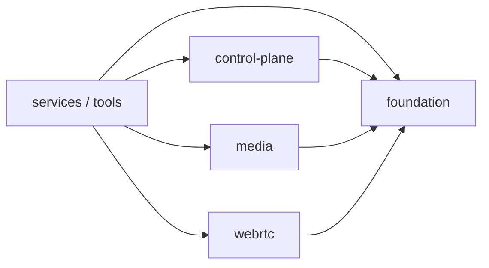
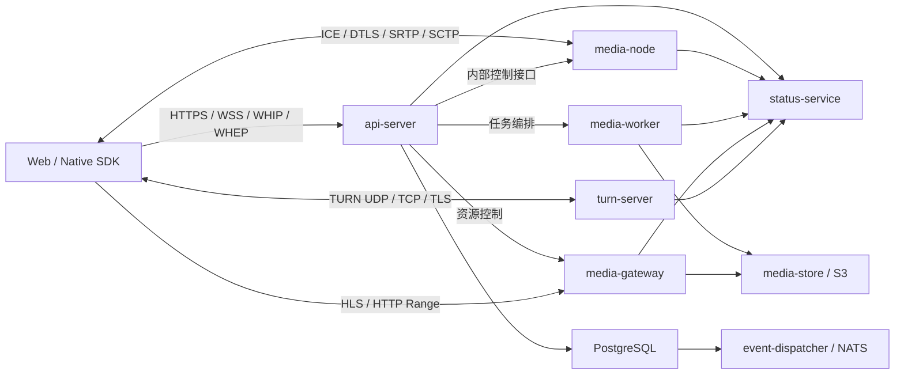

# Fluvora 代码库总览

本文面向第一次进入仓库的开发者，说明代码放在哪里、各部分负责什么，以及一次请求如何穿过系统。

## 1. 顶层目录

```text
fluvora/
├── crates/          Rust 服务、协议栈与公共能力
├── sdk/             Web、Rust、C、Android、iOS SDK
├── migrations/      PostgreSQL schema migration
├── deploy/          Docker、Compose、Kubernetes、Prometheus、Grafana
├── scripts/         构建门禁、合约检查、冒烟测试和压测入口
├── tests/browser/   Chromium、Firefox、WebKit 互操作测试
├── fuzz/            STUN、RTP、DataChannel 模糊测试
├── examples/        SDK 和浏览器接入示例
├── docs/            架构、API、运维和验收文档
└── ops-console/     运维控制台预留目录
```

主要开发工作集中在 `crates/` 和 `sdk/`。部署配置不得承载业务规则，业务规则也不应反向读取部署目录。

## 2. Rust 代码分区

`crates/` 按职责分为六个目录：

```text
crates/
├── foundation/       稳定的公共模型和基础工具
├── webrtc/           实时通信协议栈和 SFU
├── media/            非实时媒体存储、处理和转码
├── control-plane/    控制面公共能力
├── services/         可独立部署的生产进程
└── tools/            管理和性能工具
```

总体依赖方向：



`foundation` 不得依赖服务或基础设施；协议引擎不得依赖具体进程入口；`services` 只负责组合已有能力。

### 2.1 foundation：公共基础

| Crate | 职责 |
|---|---|
| `bytes-codec` | 有界字节读取、写入和网络字节序编解码 |
| `domain` | 房间、成员、角色、命令、策略和领域事件 |
| `protocol` | 房间 DataChannel 的版本化 Envelope 协议 |
| `observability` | Counter、Gauge、Histogram、组件健康状态和媒体指标 |

这一层应保持依赖轻、可独立测试，不知道 Axum、PostgreSQL、NATS 或具体服务地址。

### 2.2 webrtc：实时通信

| Crate | 职责 |
|---|---|
| `stun` | STUN 报文、属性、完整性和 fingerprint |
| `ice-lite` | ICE-lite 凭据、候选对、提名和 consent 状态机 |
| `dtls-adapter` | DTLS 身份、指纹、OpenSSL 后端和 SRTP key exporter |
| `srtp` | SRTP/SRTCP 加解密、认证和 replay window |
| `rtp` | RTP 包、序号/时间戳扩展和 header extension rewrite |
| `rtcp` | RTCP compound packet、反馈、TWCC |
| `sdp` | SDP 解析、校验和 SFU answer 生成 |
| `rtc-datagram` | STUN、DTLS、RTP、RTCP 数据报分类 |
| `rtc-session` | ICE、DTLS、SRTP 会话状态编排 |
| `data-channel` | SCTP、DCEP、SACK、PR-SCTP 和 DataChannel |
| `media-codec` | VP8、VP9、H264 载荷和分层信息识别 |
| `sfu-core` | 房间轨道、订阅、转发、重写和 NACK 缓存 |
| `congestion-control` | 带宽估计和 simulcast/SVC 层选择 |
| `turn` | TURN allocation、permission、ChannelData 和 REST credential |

这里实现协议和状态机，不负责监听生产端口或读取业务数据库。

### 2.3 media：媒体处理

| Crate | 职责 |
|---|---|
| `media-pipeline` | VOD、直播、CMAF/HLS 和实时转码的 FFmpeg 进程规格 |
| `media-store` | 本地/S3 媒体对象存储、Range 和发布边界 |
| `transcode-bridge` | codec 协商、网络质量决策、转码配额和任务协调 |

该目录处理录制、转码和分发文件，不进入 SFU 的实时包转发热路径。

### 2.4 control-plane：控制面

| Crate | 职责 |
|---|---|
| `auth` | Token、claims、scope、密钥轮换和验签 |
| `control-store` | PostgreSQL 房间、信令、outbox、lease 和 placement |
| `event-dispatcher` | PostgreSQL outbox 到 NATS JetStream 的可靠投递 |
| `status-service` | 节点心跳、容量、健康聚合和状态 HTTP 服务 |
| `status-client` | 各服务向 status-service 上报心跳 |

控制面负责“谁、何时、在哪运行”，不处理媒体包内容。

### 2.5 services：部署进程

| 服务 | 默认端口 | 入口职责 |
|---|---:|---|
| `api-server` | 8080/TCP | 鉴权、房间、信令、WHIP/WHEP、轨道和任务编排 |
| `media-node` | 8092/TCP、UDP 媒体端口 | ICE/DTLS/SRTP、DataChannel 和 SFU 数据面 |
| `media-worker` | 8091/TCP | FFmpeg VOD、直播、录制和实时转码任务 |
| `media-gateway` | 8093/TCP | 上传、对象读取、Range、HLS/CMAF 分发 |
| `turn-server` | 3478、5349、relay UDP | TURN UDP/TCP/TLS 中继 |

服务入口负责配置、生命周期、路由和用例协调。可复用状态机或规则必须下沉到其他分区。

各服务的 `main.rs` 都是迁移预算，不是推荐规模。`api-server` 已完成内部分层，入口只负责转交到
`app::run()`：

```text
api-server/src/
├── main.rs          进程入口与模块声明
├── app.rs           启动、依赖装配、路由与健康检查
├── runtime.rs       时钟、随机数、标识符与关闭信号
├── models/          状态所有权和按 capability 分组的 DTO
├── routes/          房间、信令、WebRTC 和媒体 HTTP/WS 适配
├── services/        房间命令、媒体会话和转码编排
├── persistence.rs   PostgreSQL/文件持久化和恢复
├── *_client.rs      内部 HTTP 和有界响应适配
├── protocol.rs      WHIP/WHEP、ETag 和 Trickle ICE 边界
├── signals.rs       信令持久化、分页和有界缓存
└── validation.rs    无副作用输入校验
```

详细依赖方向、请求调用链、锁所有权和扩展流程见
[`API_SERVER_STRUCTURE.md`](API_SERVER_STRUCTURE.md)。`media-gateway`、`media-node`、`media-worker` 和
`turn-server` 在继续拆分时应使用相同原则：入口只组合，输入适配与用例编排分离，可复用协议/领域
规则继续下沉到内层 crate。

### 2.6 tools：工具

| Crate | 职责 |
|---|---|
| `admin` | 管理 Token 和运维命令 |
| `perf-lab` | SFU 热路径性能基准和发布门禁 |

工具可以调用工作区能力，但生产服务和库不得反向依赖工具。

## 3. 运行时链路



### 实时 SFU

1. SDK 通过 API 加入房间并提交 SDP offer。
2. API 校验权限和 SDP，要求 media-node 创建会话。
3. 客户端直接与 media-node 完成 ICE、DTLS、SRTP。
4. media-node 使用 `rtc-session` 和 `sfu-core` 转发 RTP/RTCP。
5. DataChannel 消息由 `data-channel` 解码，再按房间规则转发。

### P2P 与 TURN

1. API 只保存有界信令记录。
2. 两个客户端优先直连。
3. 直连失败时使用 API 签发的短期 TURN credential，经 turn-server 中继。

### 直播和点播

1. API 创建 asset、live stream 或 worker job。
2. media-worker 根据 `media-pipeline` 生成并执行受控 FFmpeg 参数。
3. 产物写入 `media-store`。
4. media-gateway 提供 HLS、CMAF 和 HTTP Range。

### 控制面一致性

1. API 把房间事件、信令、任务归属和 lease 写入 PostgreSQL。
2. event-dispatcher 从 outbox 发布到 NATS JetStream。
3. 各服务通过 status-client 上报心跳和容量。
4. status-service 聚合平台健康状态。

## 4. SDK 边界

```text
sdk/
├── web/       TypeScript 浏览器 SDK
├── rust/      Rust SDK
├── c-abi/     C ABI 和头文件
├── android/   Kotlin/Android SDK
└── ios/       Swift/iOS SDK
```

SDK 只依赖公开 HTTP、WebSocket、SDP、DataChannel 和 C ABI 契约，不读取服务内部状态。Web、
Rust、Android 和 iOS 的 HTTP 实现共享严格基础 URL/token、禁用重定向及 32 MiB 成功响应/64 KiB
错误响应上限。契约与传输加固标记由 `scripts/check-sdk-contract.mjs` 校验，示例覆盖由
`scripts/check-sdk-demos.mjs` 校验。

## 5. 新代码放置规则

| 新增内容 | 放置位置 |
|---|---|
| 房间、成员、权限等纯业务规则 | `crates/foundation/domain` |
| 新的 wire envelope 或公共协议字段 | `crates/foundation/protocol` |
| RTP/RTCP/ICE/DTLS/SFU 行为 | `crates/webrtc` 对应 crate |
| FFmpeg、HLS、媒体文件处理 | `crates/media` |
| PostgreSQL、事件总线、心跳和鉴权 | `crates/control-plane` |
| HTTP/WS 路由和进程启动 | `crates/services/<service>` |
| 运维、诊断、基准工具 | `crates/tools` |
| 客户端公开能力 | `sdk/<platform>` |

如果一段逻辑会被两个服务复用，不要让一个服务依赖另一个服务；应将逻辑下沉到对应的基础分区。

## 6. 质量门禁

本地基础检查：

```powershell
powershell -NoProfile -ExecutionPolicy Bypass -File scripts/check-architecture.ps1
powershell -NoProfile -ExecutionPolicy Bypass -File scripts/check-docs.ps1
cargo fmt --all -- --check
cargo clippy --workspace --all-targets -- -D warnings
cargo test --workspace --locked
cargo check --manifest-path fuzz/Cargo.toml --bins --locked
node scripts/check-sdk-contract.mjs
```

架构门禁检查：

- 所有 workspace package 都有依赖层级；
- 35 个 workspace package 位于正确的职责目录；
- 依赖只能指向同层或更内层；
- 所有 crate 继承 workspace lint；
- 历史大型入口不得超过迁移预算；
- API 核心模块遵守行数预算、显式导入和根模块路径规则；
- 必需设计文档存在，Markdown 本地链接可解析。

完整发布验证使用 `scripts/run-release-gates.ps1`。
