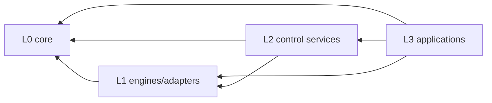

# 代码分层与依赖规则

[简体中文](LAYERS.md) | [English](en/LAYERS.md)

状态：已由 `scripts/check-architecture.ps1` 自动约束  
关联文档：[代码库总览](CODEBASE.md)、[总体架构](ARCHITECTURE.md)、
[API 服务内部设计](API_SERVER_STRUCTURE.md)

## 1. 物理目录

Fluvora 同时使用“职责目录”和“向内依赖层”。目录说明 crate 负责什么，依赖层防止可复用代码
反向依赖具体进程。

| 目录 | 职责 |
|---|---|
| `crates/foundation` | 领域词汇、wire contract、有界工具和可观测性 |
| `crates/webrtc` | STUN/ICE/DTLS/SRTP/RTP/RTCP/SDP/DataChannel/SFU 引擎 |
| `crates/media` | 媒体存储、FFmpeg 管线和转码决策 |
| `crates/control-plane` | 鉴权、持久状态、事件、心跳和容量 |
| `crates/services` | 可部署 API、media-node、gateway、worker 和 TURN 进程 |
| `crates/tools` | 管理、诊断和性能工具 |

物理目录不是依赖层的替代品。例如 `auth` 和 `control-store` 都在 `control-plane` 目录，但属于基础设施
适配层；`status-service` 和 `event-dispatcher` 属于更外层的共享控制服务。

## 2. 依赖层

| 层 | 职责 | 示例 |
|---|---|---|
| L0 Core | 领域类型、wire model、codec、纯能力 | `domain`、`rtp`、`rtcp`、`protocol` |
| L1 Engines/Adapters | 有状态协议引擎和基础设施实现 | `sfu-core`、`rtc-session`、`control-store` |
| L2 Control Services | 共享控制面协调进程/客户端 | `status-service`、`event-dispatcher` |
| L3 Applications | 进程组合、SDK 边界、CLI 和工具 | `api-server`、`media-node`、`sdk` |

允许依赖同层或更低编号层，禁止依赖更高编号层：



典型禁止关系：

- `foundation/domain` 依赖 Axum、PostgreSQL 或具体服务；
- `webrtc/sfu-core` 依赖 `media-node` 进程入口；
- `control-store` 依赖 API handler；
- 一个 deployable service 为了复用逻辑直接依赖另一个 deployable service；
- SDK 读取服务内部状态或复用仅供服务端的密钥类型。

跨服务复用逻辑必须下沉到负责该规则的内层 crate，而不是建立横向进程依赖。

## 3. 服务 crate 内部分层

deployable service 内部保持相同方向：

1. `main.rs`：只拥有进程入口；
2. composition root：解析配置、建立依赖、注册路由和后台任务；
3. transport/routes：把 HTTP、WebSocket、UDP 或 CLI 输入转换为内部类型；
4. application services：协调领域状态和基础设施适配器；
5. domain/protocol crates：保存可复用规则和状态机；
6. adapters：实现持久化、消息、媒体存储和外部进程访问。

调用方向从 1/2 指向 3/4/6，再进入 5；领域层不能回调进程入口。API 服务已经按
`app / routes / services / models / adapters` 落地，其他服务在拆分时沿用该结构，但不要求机械复制
目录名——目录应与实际 capability 对齐。

## 4. 状态和数据所有权

- 领域 aggregate 的不变量属于领域 crate；
- 持久化 schema、revision、lease 和 outbox 属于 `control-store`；
- 进程内缓存及任务句柄属于对应 deployable service；
- RTP/SRTP/SCTP 会话状态属于 WebRTC 引擎和 media-node；
- 媒体对象及发布边界属于 `media-store`/gateway；
- SDK 只拥有客户端连接状态，不成为服务端房间状态的事实来源。

NATS、心跳和指标是传播/观测机制，不是领域事实来源。

## 5. 自动门禁

本地运行：

```powershell
powershell -NoProfile -ExecutionPolicy Bypass -File scripts/check-architecture.ps1
```

门禁验证：

- 每个 workspace package 都已分类；
- package 位于正确职责目录；
- workspace 内依赖只指向同层或内层；
- 每个 crate 继承 workspace lint；
- deployable service 入口不超过迁移预算；
- API focused module 不超过各自行数预算；
- API 生产代码使用显式导入，不使用根模块 `super::` 或参数数量 lint 豁免。

入口预算和 focused-module 预算只能下降。提高预算必须伴随明确的架构决策，说明为什么现有
capability 无法继续拆分。

Windows 若没有系统 OpenSSL，可运行：

```powershell
powershell -NoProfile -ExecutionPolicy Bypass -File scripts/check-openssl-vendored.ps1
```

CI 与容器镜像始终编译生产 DTLS 特性。
