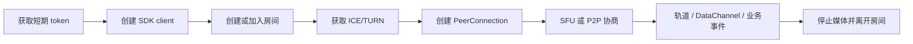

# Fluvora SDK 接入指南

状态：Production Candidate v1  
适用平台：Web/TypeScript、Rust、C/C++、Android/Kotlin、iOS/Swift  
关联文档：[公开 API](API.md)、[SDK 示例验收](SDK_DEMOS.md)、[可运行示例](../examples/README.md)

## 1. SDK 定位

Fluvora SDK 负责：

- 安全构造和发送带 Bearer token 的控制请求；
- 房间创建、加入、离开、角色、聊天和自定义事件；
- ICE/TURN 凭据、SFU offer/answer 和 P2P 信令；
- SFU 轨道注册、订阅、分层和媒体路径协商；
- VOD 上传/完成和直播 HLS 输出控制；
- 统一输入大小、基础 URL、token、重定向和响应缓冲边界。

Web SDK 直接使用浏览器标准 `RTCPeerConnection`。Rust、Android 和 Swift SDK 不捆绑特定
libwebrtc 二进制，而是通过 `WebRtcPeer`/`WebRTCPeer` 接入应用已经选择的实现。C ABI 提供稳定的
阻塞式控制/信令子集，媒体采集、PeerConnection 和渲染仍由宿主引擎负责。

## 2. 平台与能力

| 能力 | Web | Rust | Android | Swift | C ABI |
|---|---|---|---|---|---|
| 房间/聊天/自定义数据 | 完整 | 完整 | 完整 | 完整 | 基础子集 |
| ICE/TURN | 完整 | 完整 | 完整 | 完整 | 完整 |
| SFU offer/answer | 内置 PeerConnection | 宿主适配器 | 宿主适配器 | 宿主适配器 | 原始 SDP JSON |
| P2P 信令 | `P2pSession` 自动循环 | 原始信令 API | 原始信令 API | 原始信令 API | 原始信令 API |
| 轨道/订阅控制 | 完整 | 完整 | 完整 | 完整 | 不提供 |
| VOD/直播控制 | 完整 | 完整 | 完整 | 完整 | 不提供 |
| WebSocket 事件 helper | `openEventStream` | 仅签发 ticket | 仅签发 ticket | 仅签发 ticket | 不提供 |
| DataChannel Envelope | 内置编码/解码 | 宿主实现 | 宿主实现 | 宿主实现 | 宿主实现 |
| 调用模型 | Promise | async | coroutine | async/actor | 阻塞 |

C ABI 的权威能力以 [`fluvora.h`](../sdk/c-abi/include/fluvora.h) 为准，不应假设它与四个高级 SDK
拥有相同方法集合。

## 3. 接入前准备

### 3.1 服务地址

SDK 的 `baseUrl` 指向 API 服务或其 HTTPS ingress，例如：

```text
https://api.example.com
https://example.com/fluvora
```

允许保留反向代理路径前缀，但 URL 必须：

- 使用 `http` 或 `https`；生产环境使用 `https`；
- 包含 host；
- 不包含 userinfo、query 或 fragment；
- 不超过 2,048 UTF-8 字节且不含控制字符。

浏览器还需要在服务端 `FLUVORA_CORS_ORIGINS` 中配置页面的精确 origin。摄像头和麦克风只应在
HTTPS 或 `localhost` 安全上下文中使用。

### 3.2 短期 token

生产客户端从业务身份服务获取短期 token，不应持有 Fluvora 签名密钥。开发环境可以使用：

```powershell
cargo run -p fluvora-admin -- token `
  --subject 1 --room * --ttl 3600 --scopes room_create,room_join,media_publish
```

常用 scope：

| 场景 | 必要 scope |
|---|---|
| 创建房间 | `room_create` |
| 加入、离开、读取信令/ICE | `room_join` |
| 开始发布和注册轨道 | `room_join` + `media_publish` |
| 结束房间、设置角色 | `room_join` + `room_moderate` |
| VOD | `vod_manage` |
| 直播输出 | `live_manage` |
| 礼物回执 | 仅可信后端使用 `gift_verify` |

token 不得出现在 URL、日志、崩溃报告或命令行参数中。浏览器只保存在内存；移动端使用系统安全
存储；CLI 从环境变量或权限受限文件读取。

### 3.3 网络端口

客户端至少需要：

- API HTTPS/WSS；
- media-node 公布的 ICE UDP；
- TURN UDP/TCP 3478 和 TURN/TLS 5349（以部署配置为准）；
- HLS/VOD 场景的 media-gateway HTTPS。

## 4. 通用生命周期



推荐顺序：

1. 获取与当前 participant/room/scope 绑定的短期 token；
2. 创建一个可复用 client；
3. `createRoom`（房主）或取得已有 room ID；
4. `join`；
5. 需要实时媒体时获取 ICE 配置并建立 SFU/P2P PeerConnection；
6. 发布者调用 `startPublishing`，按需要注册轨道；
7. 使用 durable REST/WS 事件或低延迟 DataChannel；
8. 清理订阅、轨道、DataChannel、PeerConnection 和采集设备；
9. 调用 `stopPublishing`（发布者）和 `leave`；房主最终可调用 `end`。

`leave` 会触发服务端参与者资源清理，但客户端仍必须主动停止摄像头、麦克风、定时器和网络对象。

## 5. Web/TypeScript

### 5.1 安装与构建

当前仓库以源码交付包。先构建 SDK：

```bash
cd sdk/web
npm ci
npm run build
```

仓库示例直接导入 `sdk/web/dist/index.js`。外部项目可安装本地目录：

```bash
npm install /absolute/path/to/fluvora/sdk/web
```

包名为 `@fluvora/web`，运行环境需要 `fetch`、`ReadableStream`、`WebSocket` 和
`RTCPeerConnection`。

### 5.2 初始化与房间

```ts
import { FluvoraClient, FluvoraError } from "@fluvora/web";

const client = new FluvoraClient({
  baseUrl: "https://api.example.com",
  accessToken: async () => identityService.getFluvoraToken(),
});

const room = await client.createRoom("sfu", {
  maxMembers: 64,
  maxPublishers: 16,
});
await client.join(room.roomId);
```

异步 token provider 会在每次请求前调用并重新校验，适合应用自己的自动刷新机制。不要在 provider
失败时返回旧 token 或空字符串。

### 5.3 SFU

```ts
const localStream = await navigator.mediaDevices.getUserMedia({
  audio: true,
  video: true,
});

await client.startPublishing(room.roomId);
const session = await client.connectSfu(room.roomId, {
  localStream,
  onRemoteTrack: ({ streams, track }) => {
    remoteVideo.srcObject = streams[0] ?? new MediaStream([track]);
  },
  onNetworkSample: (sample) => console.log(sample.quality, sample.packetLossRatio),
  fallbackHlsUrl: "https://media.example.com/live/channel/master.m3u8",
  onFallback: (url) => {
    remoteVideo.srcObject = null;
    remoteVideo.src = url;
    void remoteVideo.play();
  },
  dataChannel: {
    onRoomEnvelope: (envelope) => {
      console.log(envelope.kind, new TextDecoder().decode(envelope.payload));
    },
  },
});

session.sendRoomData("chat", "hello", { acknowledgementRequired: true });
```

`connectSfu` 会获取 ICE（除非提供 `rtcConfiguration`）、建立 transceiver、在 Offer 前创建可靠有序
`fluvora.room.v1` DataChannel、等待 ICE gathering、交换 SDP 并启动浏览器 stats 采样。

如果应用选择自定义 DataChannel label，`sendData` 可发送不透明数据；权威
`fluvora.room.v1` 必须使用 `sendRoomData`，SDK 会编码 Envelope 并执行 16 KiB 上限。

### 5.4 P2P

```ts
const ice = await client.getIceConfiguration(roomId);
const peer = new RTCPeerConnection({ iceServers: ice.iceServers });
for (const track of localStream.getTracks()) peer.addTrack(track, localStream);

const p2p = client.createP2pSession(roomId, localParticipantId, peer);
p2p.start();
await p2p.offer(remoteParticipantId);

// 需要 ICE restart 时：
await p2p.restartIce(remoteParticipantId);
```

`P2pSession` 自动上报本地 candidate、轮询有界信令页、缓存远端 SDP 前到达的 candidate，并处理
offer/answer/restart/bye。结束时优先 `await p2p.hangup()`；页面卸载时至少调用 `p2p.close()`。

### 5.5 错误与释放

```ts
try {
  await client.join(roomId);
} catch (error) {
  if (error instanceof FluvoraError) {
    console.error(error.status, error.code, error.message);
  } else {
    console.error("transport/browser failure", error);
  }
}

session.close();
for (const track of localStream.getTracks()) track.stop();
await client.stopPublishing(roomId);
await client.leave(roomId);
```

完整浏览器接入见 [`examples/web`](../examples/web/README.md)。

## 6. Rust

### 6.1 依赖

当前以 workspace/path dependency 接入：

```toml
[dependencies]
fluvora-sdk = { path = "/absolute/path/to/fluvora/sdk/rust" }
tokio = { version = "1", features = ["macros", "rt-multi-thread"] }
```

### 6.2 初始化与房间

```rust
use fluvora_sdk::{Client, RoomMode, SdkError};

let client = Client::new(
    "https://api.example.com",
    short_lived_token,
)?;

let room = client
    .create_room(RoomMode::Sfu, Some(64), Some(16))
    .await?;
client.join(&room.room_id).await?;

// 应用刷新 token 后原子替换：
client.set_access_token(refreshed_token)?;
# Ok::<(), SdkError>(())
```

### 6.3 WebRTC 适配器

实现 `WebRtcPeer`，或使用 `CallbackWebRtcPeer` 包装现有引擎：

```rust
use fluvora_sdk::CallbackWebRtcPeer;

let mut peer = CallbackWebRtcPeer::new(
    move || Box::pin(async move {
        native_peer.create_and_set_local_offer().await
    }),
    move |answer| Box::pin(async move {
        native_peer.set_remote_answer(answer).await
    }),
)
.with_room_data_channel(move || Box::pin(async move {
    native_peer.create_reliable_ordered_data_channel(
        "fluvora.room.v1",
        "fluvora.v1",
    ).await
}));

let session = client.connect_sfu(&room_id, &mut peer).await?;
```

示例中的 `native_peer` 是示意接口；应用需要用自己的 WebRTC crate/FFI 实现对应回调。真实可编译的
控制/文件 SDP 示例见 [`room_client.rs`](../sdk/rust/examples/room_client.rs)。

Rust 错误统一为 `SdkError`。`SdkError::Api { status, code, message }` 表示服务端结构化错误；
`Transport`、`ResponseTooLarge`、`InvalidJsonResponse` 和 `WebRtc` 应分别处理和记录。

## 7. Android/Kotlin

### 7.1 工程要求与依赖

- minSdk 26；
- compileSdk 36；
- Java 17；
- Kotlin coroutine 与 serialization。

当前使用源码 module。宿主 `settings.gradle.kts`：

```kotlin
include(":fluvora")
project(":fluvora").projectDir = file("/absolute/path/to/fluvora/sdk/android/fluvora")
```

应用模块：

```kotlin
dependencies {
    implementation(project(":fluvora"))
    implementation("org.jetbrains.kotlinx:kotlinx-coroutines-android:1.11.0")
    implementation("org.jetbrains.kotlinx:kotlinx-serialization-json:1.11.0")
}
```

### 7.2 初始化

```kotlin
import com.fluvora.sdk.FluvoraClient
import com.fluvora.sdk.RoomMode

val client = FluvoraClient(
    baseUrl = "https://api.example.com",
    accessToken = shortLivedToken,
)

val room = client.createRoom(RoomMode.SFU, maxMembers = 64, maxPublishers = 16)
client.join(room.roomId)

// 刷新后替换，不能传空 token：
client.setAccessToken(refreshedToken)
```

所有网络方法都是 `suspend`，从 lifecycle-aware coroutine scope 调用，不要使用
`GlobalScope`。

### 7.3 WebRTC 注入

```kotlin
val ice = client.getIceConfiguration(roomId)
val nativePeer = applicationWebRtcFactory.create(ice.iceServers)

val peer = CallbackWebRtcPeer(
    createOffer = {
        nativePeer.createAndSetLocalOfferAfterIceGathering()
    },
    applyRemoteAnswer = { sdp ->
        nativePeer.setRemoteAnswer(sdp)
    },
    createRoomDataChannel = {
        nativePeer.createDataChannel(
            label = "fluvora.room.v1",
            protocol = "fluvora.v1",
            ordered = true,
        )
    },
)

client.startPublishing(roomId)
val session = client.connectSfu(roomId, peer)
```

这里的 `applicationWebRtcFactory`/`nativePeer` 是宿主接口。适配器必须在生成 Offer 前添加采集轨道和
DataChannel，返回已设置为 local description 且完成 ICE gathering 的完整 SDP，并在离开页面时停止
capture、renderer、tracks、DataChannel 和 PeerConnection。

API 错误为 `FluvoraException(status, code, message)`；本地输入错误通常是
`IllegalArgumentException`。可运行应用见 [Android demo](../sdk/android/demo/README.md)。

## 8. iOS/Swift

### 8.1 平台与 Swift Package

支持 iOS 16+、macOS 13+。在 Xcode 中添加本地 package `sdk/ios`，或在 `Package.swift` 中：

```swift
dependencies: [
    .package(path: "/absolute/path/to/fluvora/sdk/ios")
]
```

target 添加 `.product(name: "Fluvora", package: "Fluvora")`。

### 8.2 初始化与 WebRTC

```swift
import Fluvora

let client = try FluvoraClient(
    baseURL: URL(string: "https://api.example.com")!,
    accessToken: shortLivedToken
)

let room = try await client.createRoom(
    mode: .sfu,
    maxMembers: 64,
    maxPublishers: 16
)
_ = try await client.join(roomId: room.roomId)

let ice = try await client.getIceConfiguration(roomId: room.roomId)
let nativePeer = try await applicationWebRTCFactory.makePeer(iceServers: ice.iceServers)
let peer = CallbackWebRTCPeer(
    createAndSetLocalOffer: {
        try await nativePeer.createAndSetLocalOfferAfterIceGathering()
    },
    setRemoteAnswer: { sdp in
        try await nativePeer.setRemoteAnswer(sdp)
    },
    prepareRoomDataChannel: {
        try await nativePeer.createReliableOrderedDataChannel(
            label: "fluvora.room.v1",
            protocol: "fluvora.v1"
        )
    }
)

_ = try await client.startPublishing(roomId: room.roomId)
let session = try await client.connectSFU(roomId: room.roomId, peer: peer)
```

`FluvoraClient` 是 actor，token 刷新使用 `try await client.setAccessToken(...)`。结构化 API 错误为
`FluvoraAPIError`；网络、解码和宿主 WebRTC 错误仍可能是其他 `Error`。

`applicationWebRTCFactory`/`nativePeer` 是示意接口。可构建 SwiftUI 工程和注入点见
[iOS demo](../sdk/ios/Examples/FluvoraDemoApp/README.md)。

## 9. C/C++ ABI

### 9.1 构建与链接

```bash
cargo build -p fluvora-c-abi --release
cmake -S sdk/c-abi/examples -B target/c-demo \
  -DFLUVORA_LIBRARY_DIR="$PWD/target/release"
cmake --build target/c-demo
```

包含 [`fluvora.h`](../sdk/c-abi/include/fluvora.h)，链接生成的 `fluvora_c_abi` 静态库或动态库。
Windows 静态链接方在 include 前定义 `FLUVORA_STATIC`。

### 9.2 所有权和线程

```c
FluvoraClient *client = fluvora_client_new(base_url, access_token);
if (client == NULL) {
    /* configuration/runtime creation failed */
}

char *json = NULL;
int status = fluvora_join_room(client, room_id, &json);
if (status == FLUVORA_OK) {
    /* parse json before freeing it */
}
fluvora_string_free(json);

fluvora_client_set_access_token(client, refreshed_token);
fluvora_client_free(client);
```

规则：

- 所有输入是有效、NUL 结尾的 UTF-8；
- 每个非空 `out_json` 必须且只能调用一次 `fluvora_string_free`；
- client 必须且只能调用一次 `fluvora_client_free`；传 null 给 free 是允许的；
- 网络函数阻塞，必须移出 UI、游戏 render 和 audio callback 线程；
- 同一 client 内部 runtime 使用互斥锁，追求并发时使用任务队列或独立 client；
- `FLUVORA_SDK_ERROR` 不携带细分 API 错误 JSON，宿主需要记录操作上下文并按读接口核对状态。

状态码：`FLUVORA_OK`、`FLUVORA_INVALID_ARGUMENT`、`FLUVORA_SDK_ERROR`、
`FLUVORA_ENCODING_ERROR`、`FLUVORA_PANIC`。完整示例见
[C ABI demo](../sdk/c-abi/examples/README.md)。

## 10. 原生 WebRTC 适配器契约

Rust、Android 和 Swift 适配器必须遵循相同顺序：

1. 调用 `getIceConfiguration`，用返回的 TURN username/credential 创建 PeerConnection；
2. 添加本地音视频轨道和需要的 recv transceiver；
3. 在 Offer 前创建可靠、有序、protocol 为 `fluvora.v1` 的 `fluvora.room.v1` DataChannel；
4. 创建 Offer、设置 local description，并等待 ICE gathering 完成；
5. 把完整 SDP 返回给 SDK；
6. SDK POST offer，得到 answer；
7. 适配器把 answer 设置到同一个 PeerConnection；
8. 宿主监听 remote tracks、connection state、ICE failure 和 DataChannel；
9. 离开时宿主关闭 PeerConnection 并释放采集/渲染资源。

`prepareRoomDataChannel` 有默认空实现，只适用于明确不需要房间 DataChannel 的 media-only 客户端。
不要在调用 `connectSfu` 之后才创建权威 DataChannel，否则它不会进入本次 SDP 协商。

当前 `/webrtc/offer` 流程使用完整 ICE-gathered SDP。需要 Trickle ICE 或资源级 ICE restart 的客户端
应直接采用 [WHIP/WHEP 接口](API.md#webrtc-与-sfu) 并维护 `Location`/`ETag`。

## 11. P2P 信令循环

除 Web 的 `P2pSession` 外，宿主需要实现以下循环：

1. 建立带 Fluvora ICE/TURN 配置的 PeerConnection；
2. 本地产生 offer/answer/candidate 时调用 `postSignal`；
3. 保存 `latestSequence`，使用 `pollSignals(roomId, after)` 增量拉取；
4. 忽略自己发出的 signal，并按 `to` 过滤目标 participant；
5. SDP 未设置前到达的 candidate 暂存，设置 remote description 后按顺序应用；
6. `ice-restart` 生成/应用新的 ICE credential；
7. `bye` 关闭本地媒体和轮询任务；
8. 空页采用有界退避，页面/进程关闭时取消任务。

允许 kind：`offer`、`answer`、`ice-candidate`、`ice-restart`、`renegotiate`、`bye`。媒体始终在客户端
之间端到端传输，API 只保存有界信令记录。

## 12. Durable 事件与 DataChannel

根据语义选择通道：

| 数据 | 推荐通道 | 原因 |
|---|---|---|
| 聊天记录、业务自定义事件 | `sendChat`/`sendCustomData` + events | 有序、持久、可回放 |
| presence、弱网控制、瞬时互动 | DataChannel | 低延迟，不要求持久 |
| 礼物/支付结果 | 可信后端 `recordVerifiedGift` | 必须验签，禁止客户端伪造 |
| P2P SDP/candidate | signal API | 与 P2P 房间序列关联 |

Web 使用 `issueEventTicket` + `openEventStream`。原生客户端先调用 `issueEventTicket`，再连接：

```text
wss://api.example.com/v1/rooms/{room_id}/events?ticket={ticket}&after={sequence}
```

ticket 单次使用、短期有效且绑定 participant。收到 `system.resync_required` 后关闭旧游标并从信令/
业务读接口恢复，不能假设 WebSocket broadcast 永不丢失。

## 13. 轨道、订阅与媒体路径

发布者顺序：

1. `startPublishing`；
2. 完成 WebRTC 协商；
3. 从实际 RTP sender/SDP 获取 payload type、SSRC、clock rate、RID/编码层；
4. `publishTrack` 注册与实际发送参数一致的轨道；
5. 停止时 `unpublishTrack`，最后 `stopPublishing`。

订阅者通过 `subscribeTrack` 提供目标 SSRC/payload type、codec 能力、目标分辨率/码率以及是否允许
转码。响应 `path`：

- `direct`：SFU 直接转发；
- `transcode`：共享实时转码输出；
- `hls`：返回 `fallbackUrl`；
- `existing`：幂等命中已有结果。

不要假定订阅一定返回实时轨道；必须处理 HLS fallback。运行期间可以调用
`setSubscriptionLayer` 调整 simulcast/SVC 空间层和时间层。

## 14. VOD 与直播

VOD 基本流程：

1. `createAsset(assetId, tenantId)`；
2. 按服务返回的 `receivedBytes` 用 `uploadAssetChunk` 续传，每块 1..8 MiB；
3. `completeAsset` 提交源大小、分片时长和 rendition；
4. 轮询 `getAsset`，直到 `ready` 或 `failed`；
5. 使用 `manifestUrl` 播放；不再需要时 `deleteAsset`。

直播可以：

- 用 `createLiveOutputFromTracks`/`createLiveAbrOutputFromTracks` 把已发布 WebRTC 轨道交给 worker；
- 或由外部打包器顺序调用 `uploadLiveInit`、`uploadLiveSegment`、`finishLiveOutput`。

rendition 最多 8 档。应用必须处理 worker 创建失败、转码失败、manifest 尚未就绪和播放器不支持原生
HLS 的情况；Web 非 Safari 环境通常需要应用自己的 MSE/HLS 播放器。

## 15. 输入与响应边界

| 项目 | 上限 |
|---|---:|
| base URL | 2,048 UTF-8 字节 |
| access token | 1..4,096 字节，无控制字符 |
| 普通 JSON 请求 | 1 MiB |
| 成功 JSON 响应 | 32 MiB |
| 错误响应 | 64 KiB |
| 聊天 | 1..4,096 UTF-8 字节 |
| custom namespace | 1..64 个安全 ASCII 字符 |
| custom JSON payload | 60 KiB |
| P2P signal payload | 64 KiB |
| SDP | 256 KiB |
| 媒体上传块 | 1..8 MiB |
| 单次 signal page | 128 条 |
| DataChannel 完整消息 | 16 KiB |
| 权威 Envelope payload | 16,324 字节 |

SDK 在请求前检查主要边界，并在流式读取过程中限制响应；服务端仍会再次验证。字符长度不能替代
UTF-8 字节长度。

## 16. 错误、重试与幂等

建议分类：

| 类型 | 处理 |
|---|---|
| 本地参数错误 | 修正输入，不重试 |
| 401 | 刷新 token 后最多重试一次 |
| 403 | scope/room/成员权限错误，不自动重试 |
| 404 | 核对 room/track/asset 生命周期 |
| 409 | 读取最新状态，按业务决定是否重试 |
| 413/422 | 修正大小或字段 |
| 429/502/503/网络超时 | 指数退避、抖动和总时限；先核对写入结果 |

高级 SDK 为每次写方法调用生成 `Idempotency-Key`，但不会自动重放请求。应用再次调用同一方法会生成
新的 key；当“服务端可能已提交但响应丢失”时，先调用 `getRoom`/`getAsset`/`getLiveOutput` 等读接口
核对结果，避免盲目重复创建。需要跨进程稳定幂等键的服务端集成应直接使用公开 API 或扩展 SDK
以接受业务 command ID。

重试使用指数退避（例如 200 ms、500 ms、1 s、2 s）和随机抖动，并设置整体 deadline。媒体协商失败
时关闭旧 PeerConnection 后重新建立，不复用处于 failed 状态的对象。

## 17. Token 刷新

| SDK | 刷新方式 |
|---|---|
| Web | `accessToken: async () => ...` |
| Rust | `client.set_access_token(token)` |
| Android | `client.setAccessToken(token)` |
| Swift | `try await client.setAccessToken(token)` |
| C | `fluvora_client_set_access_token(client, token)` |

在 token 过期前刷新；并发刷新应 single-flight，其他请求等待同一个刷新结果。401 后只允许一次强制刷新，
再次 401 交给登录态处理，避免无限循环。

## 18. 资源释放检查表

- 停止所有本地 `MediaStreamTrack`/camera/microphone capture；
- 取消 WebSocket、signal polling、stats timer 和 coroutine/task；
- 关闭 DataChannel 和 PeerConnection；
- 取消 SFU subscriptions；
- 发布者 unpublish tracks 并 stop publishing；
- 调用 `leave`；房主按业务调用 `end`；
- 清空 video renderer/srcObject；
- C ABI 释放所有 JSON 字符串和 client；
- 不在析构/页面卸载的同步路径中等待不确定时长的网络请求。

## 19. 常见问题

### 浏览器提示 CORS

将页面精确 origin 加入 `FLUVORA_CORS_ORIGINS`，确认 OPTIONS 未被 ingress 拦截。不要使用带路径的
origin，也不要在生产环境无条件允许 `*`。

### 摄像头/麦克风不可用

使用 HTTPS 或 localhost，检查系统权限、设备占用和浏览器 autoplay 策略。移动端同时配置平台权限
描述和运行时授权。

### SFU 有 SDP answer 但没有媒体

检查本地轨道是否在 Offer 前添加、ICE/DTLS 状态、media-node UDP 可达性、payload type/SSRC 是否与
`publishTrack` 一致，以及远端 renderer 是否绑定到收到的 track。

### P2P 只能同网工作

检查 `getIceConfiguration` 返回的 TURN URLs、credential 是否过期，公网 3478/5349 和 relay 端口是否
开放，并用独立网络验证 UDP/TCP/TLS TURN。

### 收到 401/403

401 通常是过期/无效 token；403 是 scope、room binding、成员或资源所有权不满足。不要把管理员或
`gift_verify` token 分发到客户端。

### HLS fallback 无法播放

确认 `manifestUrl` 可从客户端网络访问、CORS/content type 正确、清单只含相对安全 URI，并为不支持
原生 HLS 的浏览器提供播放器实现。

## 20. 验证与上线清单

仓库级检查：

```powershell
node scripts/check-sdk-contract.mjs
node scripts/check-sdk-demos.mjs
powershell -NoProfile -ExecutionPolicy Bypass -File scripts/check-docs.ps1
powershell -NoProfile -ExecutionPolicy Bypass -File scripts/run-release-gates.ps1 -Profile full
```

接入应用上线前确认：

- token 获取、刷新、登出和日志脱敏已测试；
- SFU/P2P 在至少两类 NAT 下通过，TURN UDP/TCP/TLS 有证据；
- 摄像头、麦克风、后台/前台切换和来电打断能正确释放/恢复；
- 弱网、断网重连、ICE restart、服务端 502/503 和超时有界；
- DataChannel、WebSocket resync 和 durable 事件不会重复产生业务副作用；
- VOD/直播播放器处理 loading、failed、fallback 和清理；
- Android/iOS 使用最终发布的 WebRTC 二进制、ABI、签名和真机矩阵验证；
- C/C++ 集成经过 ASan/UBSan 或等价内存工具验证所有权。
