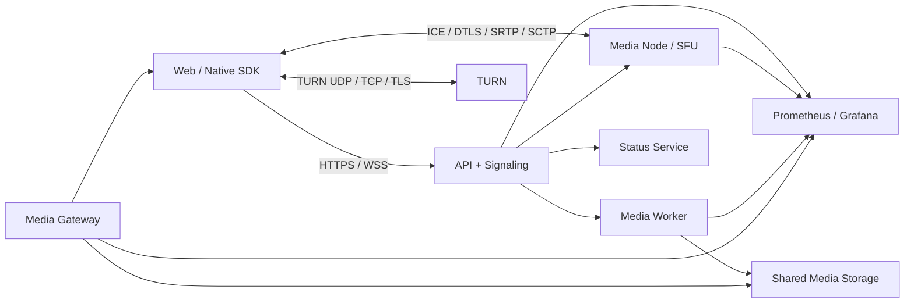

# Fluvora architecture

[简体中文](../ARCHITECTURE.md) | [English](ARCHITECTURE.md)

Status: Production Candidate v1  
Backend: Rust 2024 Edition

## 1. Goals and boundaries

Fluvora uses one control plane for four media modes without forcing them through one data path.

| Mode | Data path | Typical goal |
|---|---|---|
| WebRTC P2P | Direct client connection, with Fluvora TURN fallback | One-to-one, low cost |
| WebRTC SFU | Publisher → media node → subscribers | Calls and interactive live video |
| Live | WebRTC track → worker → CMAF/HLS | Large audiences and CDN delivery |
| VOD | Chunk upload → probe/transcode → HLS/HTTP Range | Recorded media playback |

The repository implements the WebRTC/SFU/TURN protocol core rather than embedding `webrtc-rs`,
Pion, mediasoup, Janus, LiveKit, or coturn. OpenSSL supplies audited DTLS, certificate, and ECDHE
primitives. FFmpeg supplies codecs, probing, transcoding, and container processing. Real-time SFU
forwarding never traverses FFmpeg.

## 2. Runtime topology

The control plane owns authentication, room state, durable events, idempotency, placement, and
session provisioning. Media nodes own live transport state and packet forwarding. Workers own
FFmpeg processes and generated media. The gateway exposes bounded Range and HLS access.

## 3. Service responsibilities

| Process | Responsibility | Durable ownership |
|---|---|---|
| `fluvora-api-server` | Public HTTP/WSS, rooms, signaling, media orchestration | Room/event state through the control store |
| `fluvora-media-node` | Shared UDP socket, ICE-lite, DTLS-SRTP, SCTP/DataChannel, SFU | None; session state is reconstructable |
| `fluvora-media-worker` | Probe, transcode, recording, live-to-HLS | Media objects and task results |
| `fluvora-media-gateway` | HLS and byte-range delivery | None |
| `fluvora-turn-server` | Authenticated UDP/TCP/TLS relay | Ephemeral allocations and permissions |
| `fluvora-status-service` | Heartbeats, capacity, draining, placement | Current node/service status |
| `fluvora-event-dispatcher` | Outbox delivery to external infrastructure | Delivery cursor and leases |

## 4. WebRTC session

1. The SDK obtains a short-lived bearer token from the product identity service.
2. The API validates the room, participant, scopes, bounded SDP, and media mode.
3. The API selects a healthy media node and provisions a session through its authenticated control
   endpoint before returning an SDP answer.
4. The browser or native engine performs ICE checks against the advertised host or TURN candidate.
5. The media node authenticates STUN, nominates a tuple, verifies the DTLS certificate fingerprint,
   derives SRTP keys, and starts protected media/DataChannel processing.
6. Leave/end operations and timeouts reclaim sessions, tracks, subscriptions, and worker tasks.

SDP session identifiers are nonzero signed 63-bit values for cross-browser compatibility. ICE
candidates must advertise the interface that can source responses; browser-interoperability gates
derive this address from the host route instead of hard-coding loopback.

## 5. SFU and adaptation

The SFU indexes rooms, publishers, tracks, encodings, and subscriptions. It rewrites SSRC, sequence,
timestamp, payload type, MID/TWCC extensions, and selected spatial/temporal layers per subscriber.
NACK and PLI flow upstream, while Transport-CC samples feed congestion-control decisions. Direct
forwarding is preferred; transcoding is admitted only when codec negotiation cannot produce a
direct path and policy allows it.

State is bounded by per-process session limits, per-room membership/track limits, packet-history
windows, retransmission budgets, and queue sizes. Capacity is published through heartbeats and used
by placement.

## 6. DataChannel and room data

The native path implements SCTP association setup, cookies, DATA/SACK, ordered and unordered
delivery, fragmentation, retransmission, PR-SCTP, FORWARD-TSN, DCEP, and stream reset. The common
Fluvora envelope distinguishes chat/control/custom payload kinds and carries a bounded sequence.

Durable room events remain in the control store and are replayable over WebSocket. DataChannel is
the low-latency path; applications must not treat delivery there as durable unless the corresponding
control-plane command succeeds.

## 7. P2P

The API stores bounded offers, answers, and ICE candidates as ordered signaling records. Peers poll
or subscribe with cursors; the media plane is direct whenever possible and uses Fluvora TURN when
NAT or policy prevents direct connectivity. Authorization remains room- and participant-scoped.

## 8. Live and VOD

Live pipelines ingest published RTP, reconstruct or transcode media in the worker, and emit rolling
CMAF/HLS outputs. VOD uses bounded chunk upload, explicit completion, probing, an idempotent task
state machine, multi-bitrate outputs, and gateway delivery. The control plane stores metadata and
state; large bytes stay in media/object storage.

## 9. Monitoring and recovery

Every service exposes liveness, readiness, metrics, and bounded structured state. Important signals
include active sessions, placement capacity, packet drops, authentication failures, processing
latency, retransmissions, outbox lag, worker restarts, HLS age, and TURN allocation pressure.

Sessions and media tasks are reconstructable after process loss. Durable commands use PostgreSQL
transactions, optimistic revisions, idempotency keys, outbox writes, and fenced leases. Recovery
procedures and evidence requirements are defined in the [runbook](RUNBOOK.md).

## 10. Security model

- Product backends, not clients, hold token-signing and gift-verification secrets.
- Public requests use short-lived scoped bearer tokens and strict request-size limits.
- Internal control endpoints use separate service tokens and should be isolated by network policy.
- DTLS fingerprints bind SDP signaling to the peer certificate; SRTP protects media.
- TURN uses time-bounded credentials, allocation quotas, permission/channel checks, and relay ranges.
- Base URLs reject userinfo, query, fragment, control characters, and unsafe redirects.
- Secrets are injected through environment/secret stores and never committed.

## 11. Verification strategy

The release gates cover formatting, linting, unit/integration tests, SDK contracts, browser
interoperability, TURN transports, production DTLS, transcoding, live/VOD HLS, capacity, and soak
profiles. PostgreSQL and platform-specific SDKs are additionally exercised on their native GitHub
Actions runners. See [production acceptance](PRODUCTION_ACCEPTANCE.md).

## 12. Detailed design boundaries

- Workspace dependency rules: [Layering rules](LAYERS.md)
- Directory and crate ownership: [Codebase guide](CODEBASE.md)
- API internals: [API service design](API_SERVER_STRUCTURE.md)
- Public protocol surface: [Public API](API.md)
- Client integration: [SDK integration](SDK_INTEGRATION.md)
