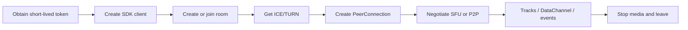

# Fluvora SDK integration guide

[简体中文](../SDK_INTEGRATION.md) | [English](SDK_INTEGRATION.md)

Status: Production Candidate v1  
Platforms: Web/TypeScript, Rust, C/C++, Android/Kotlin, iOS/Swift  
Related: [Public API](API.md), [SDK demos](SDK_DEMOS.md),
[runnable examples](../../examples/README.md)

## 1. SDK scope

Fluvora SDKs provide safe bearer-authenticated control requests; room lifecycle, roles, chat, and
custom events; ICE/TURN, SFU offer/answer, and P2P signaling; track/subscription controls; VOD and
live output controls; and consistent limits for URLs, tokens, redirects, request bodies, and streamed
responses.

The Web SDK uses the browser's `RTCPeerConnection`. Rust, Android, and Swift deliberately do not
bundle one native libwebrtc binary; applications connect their selected engine through
`WebRtcPeer`/`WebRTCPeer`. The C ABI provides a stable blocking control/signaling subset while the
host engine remains responsible for capture, rendering, and peer connections.

## 2. Platform capabilities

| Capability | Web | Rust | Android | Swift | C ABI |
|---|---|---|---|---|---|
| Rooms/chat/custom data | Full | Full | Full | Full | Basic subset |
| ICE/TURN | Full | Full | Full | Full | Full |
| SFU offer/answer | Built-in peer | Host adapter | Host adapter | Host adapter | Raw SDP JSON |
| P2P signaling | Managed `P2pSession` | Raw signaling | Raw signaling | Raw signaling | Raw signaling |
| Track/subscription control | Full | Full | Full | Full | Not exposed |
| VOD/live control | Full | Full | Full | Full | Not exposed |
| WebSocket event helper | `openEventStream` | Ticket only | Ticket only | Ticket only | Not exposed |
| DataChannel envelope | Built in | Host implementation | Host implementation | Host implementation | Host implementation |
| Call model | Promise | async | coroutine | async/actor | blocking |

The authoritative C ABI surface is [`fluvora.h`](../../sdk/c-abi/include/fluvora.h); do not assume it
matches all high-level SDK methods.

## 3. Prerequisites

### 3.1 Service URL

`baseUrl` points to the API or HTTPS ingress and may include a reverse-proxy path prefix:

```text
https://api.example.com
https://example.com/fluvora
```

It must use HTTP/HTTPS, include a host, contain no userinfo/query/fragment/control characters, and
fit within 2,048 UTF-8 bytes. Production uses HTTPS. Browser origins must be explicitly listed in
`FLUVORA_CORS_ORIGINS`; camera and microphone access require HTTPS or localhost.

### 3.2 Short-lived token

Production clients obtain a short-lived token from the product identity service and never hold the
Fluvora signing secret. A development token can be issued with:

```powershell
cargo run -p fluvora-admin -- token `
  --subject 1 --room * --ttl 3600 --scopes room_create,room_join,media_publish
```

| Scenario | Required scope |
|---|---|
| Create room | `room_create` |
| Join/leave/read signaling and ICE | `room_join` |
| Start publishing/register track | `room_join` + `media_publish` |
| End room/set roles | `room_join` + `room_moderate` |
| VOD | `vod_manage` |
| Live output | `live_manage` |
| Verified gift receipt | Trusted backend with `gift_verify` only |

Never put tokens in URLs, logs, crash reports, or command-line arguments. Keep browser tokens in
memory, mobile tokens in platform secure storage, and CLI tokens in environment variables or
permission-restricted files.

### 3.3 Network ports

Clients need API HTTPS/WSS, the media node's advertised ICE UDP endpoint, TURN UDP/TCP `3478` and
TURN/TLS `5349` (subject to deployment configuration), and media-gateway HTTPS for HLS/VOD.

## 4. Common lifecycle



1. Obtain a token bound to the participant, room, and required scopes.
2. Create one reusable client.
3. Create a room as owner, or obtain an existing room ID.
4. Join the room.
5. For real-time media, obtain ICE configuration and establish SFU/P2P transport.
6. Publishers call `startPublishing` and register actual RTP tracks as needed.
7. Use REST/WSS for durable events and DataChannel for low-latency transient data.
8. Remove subscriptions/tracks and close DataChannels, peer connections, and capture devices.
9. Publishers call `stopPublishing`; all participants call `leave`; owners may finally call `end`.

Server-side `leave` cleanup does not replace client-side capture, renderer, timer, and network cleanup.

## 5. Web/TypeScript

### 5.1 Install and build

```bash
cd sdk/web
npm ci
npm run build
npm install /absolute/path/to/fluvora/sdk/web
```

The package is `@fluvora/web` and requires `fetch`, `ReadableStream`, `WebSocket`, and
`RTCPeerConnection`.

### 5.2 Client and room

```ts
import { FluvoraClient, FluvoraError } from "@fluvora/web";

const client = new FluvoraClient({
  baseUrl: "https://api.example.com",
  accessToken: async () => identityService.getFluvoraToken(),
});

const room = await client.createRoom("sfu", {
  maxMembers: 64,
  maxPublishers: 16,
});
await client.join(room.roomId);
```

The async provider runs and is revalidated before every request. Do not return an empty or stale
token after refresh failure.

### 5.3 SFU

```ts
const localStream = await navigator.mediaDevices.getUserMedia({ audio: true, video: true });

await client.startPublishing(room.roomId);
const session = await client.connectSfu(room.roomId, {
  localStream,
  onRemoteTrack: ({ streams, track }) => {
    remoteVideo.srcObject = streams[0] ?? new MediaStream([track]);
  },
  onNetworkSample: (sample) => console.log(sample.quality, sample.packetLossRatio),
  fallbackHlsUrl: "https://media.example.com/live/channel/master.m3u8",
  onFallback: (url) => {
    remoteVideo.srcObject = null;
    remoteVideo.src = url;
    void remoteVideo.play();
  },
  dataChannel: {
    onRoomEnvelope: (envelope) => console.log(envelope.kind, envelope.payload),
  },
});

session.sendRoomData("chat", "hello", { acknowledgementRequired: true });
```

`connectSfu` obtains ICE unless `rtcConfiguration` is supplied, creates transceivers and the reliable
ordered `fluvora.room.v1` DataChannel before the offer, waits for ICE gathering, exchanges SDP, and
starts browser stats sampling. Use `sendRoomData` for the authoritative envelope; use `sendData`
only for custom labels and opaque data.

### 5.4 P2P

```ts
const ice = await client.getIceConfiguration(roomId);
const peer = new RTCPeerConnection({ iceServers: ice.iceServers });
for (const track of localStream.getTracks()) peer.addTrack(track, localStream);

const p2p = client.createP2pSession(roomId, localParticipantId, peer);
p2p.start();
await p2p.offer(remoteParticipantId);
await p2p.restartIce(remoteParticipantId);
```

`P2pSession` sends local candidates, polls bounded signaling pages, buffers candidates received
before remote SDP, and handles offer/answer/restart/bye. Prefer `await p2p.hangup()`; at minimum call
`p2p.close()` during page teardown.

### 5.5 Errors and cleanup

```ts
try {
  await client.join(roomId);
} catch (error) {
  if (error instanceof FluvoraError) {
    console.error(error.status, error.code, error.message);
  }
}

session.close();
for (const track of localStream.getTracks()) track.stop();
await client.stopPublishing(roomId);
await client.leave(roomId);
```

See the [Web example](../../examples/web/README.md).

## 6. Rust

### 6.1 Dependency and client

```toml
[dependencies]
fluvora-sdk = { path = "/absolute/path/to/fluvora/sdk/rust" }
tokio = { version = "1", features = ["macros", "rt-multi-thread"] }
```

```rust
use fluvora_sdk::{Client, RoomMode, SdkError};

let client = Client::new("https://api.example.com", short_lived_token)?;
let room = client.create_room(RoomMode::Sfu, Some(64), Some(16)).await?;
client.join(&room.room_id).await?;
client.set_access_token(refreshed_token)?;
# Ok::<(), SdkError>(())
```

### 6.2 WebRTC adapter

Implement `WebRtcPeer` or wrap an existing engine with `CallbackWebRtcPeer`:

```rust
use fluvora_sdk::CallbackWebRtcPeer;

let mut peer = CallbackWebRtcPeer::new(
    move || Box::pin(async move { native_peer.create_and_set_local_offer().await }),
    move |answer| Box::pin(async move { native_peer.set_remote_answer(answer).await }),
)
.with_room_data_channel(move || Box::pin(async move {
    native_peer
        .create_reliable_ordered_data_channel("fluvora.room.v1", "fluvora.v1")
        .await
}));

let session = client.connect_sfu(&room_id, &mut peer).await?;
```

`native_peer` represents the application's crate or FFI engine. See the compiling
[`room_client.rs`](../../sdk/rust/examples/room_client.rs). Structured server failures are
`SdkError::Api`; handle `Transport`, `ResponseTooLarge`, `InvalidJsonResponse`, and `WebRtc`
separately.

## 7. Android/Kotlin

Requirements: minSdk 26, compileSdk 36, Java 17, Kotlin coroutines and serialization. Include the
source module:

```kotlin
// settings.gradle.kts
include(":fluvora")
project(":fluvora").projectDir = file("/absolute/path/to/fluvora/sdk/android/fluvora")
```

```kotlin
val client = FluvoraClient(
    baseUrl = "https://api.example.com",
    accessToken = shortLivedToken,
)
val room = client.createRoom(RoomMode.SFU, maxMembers = 64, maxPublishers = 16)
client.join(room.roomId)
client.setAccessToken(refreshedToken)
```

All network methods are `suspend`; use a lifecycle-aware scope, never `GlobalScope`.

```kotlin
val ice = client.getIceConfiguration(roomId)
val nativePeer = applicationWebRtcFactory.create(ice.iceServers)
val peer = CallbackWebRtcPeer(
    createOffer = { nativePeer.createAndSetLocalOfferAfterIceGathering() },
    applyRemoteAnswer = { sdp -> nativePeer.setRemoteAnswer(sdp) },
    createRoomDataChannel = {
        nativePeer.createDataChannel(
            label = "fluvora.room.v1",
            protocol = "fluvora.v1",
            ordered = true,
        )
    },
)
client.startPublishing(roomId)
val session = client.connectSfu(roomId, peer)
```

The host adds capture tracks and the DataChannel before creating the offer, returns a set local
description after ICE gathering, and releases capture, renderer, tracks, DataChannel, and peer on
teardown. API errors are `FluvoraException`; local input errors are usually
`IllegalArgumentException`. See the [Android demo](../../sdk/android/demo/README.md).

## 8. iOS/Swift

Supported targets are iOS 16+ and macOS 13+. Add the local `sdk/ios` Swift package and the
`Fluvora` product.

```swift
import Fluvora

let client = try FluvoraClient(
    baseURL: URL(string: "https://api.example.com")!,
    accessToken: shortLivedToken
)
let room = try await client.createRoom(mode: .sfu, maxMembers: 64, maxPublishers: 16)
_ = try await client.join(roomId: room.roomId)

let ice = try await client.getIceConfiguration(roomId: room.roomId)
let nativePeer = try await applicationWebRTCFactory.makePeer(iceServers: ice.iceServers)
let peer = CallbackWebRTCPeer(
    createAndSetLocalOffer: {
        try await nativePeer.createAndSetLocalOfferAfterIceGathering()
    },
    setRemoteAnswer: { sdp in
        try await nativePeer.setRemoteAnswer(sdp)
    },
    prepareRoomDataChannel: {
        try await nativePeer.createReliableOrderedDataChannel(
            label: "fluvora.room.v1",
            protocol: "fluvora.v1"
        )
    }
)

_ = try await client.startPublishing(roomId: room.roomId)
let session = try await client.connectSFU(roomId: room.roomId, peer: peer)
```

`FluvoraClient` is an actor. Refresh with `try await client.setAccessToken(...)`. Structured server
errors are `FluvoraAPIError`; transport, decoding, and host WebRTC failures may be other `Error`
types. See the [SwiftUI demo](../../sdk/ios/Examples/FluvoraDemoApp/README.md).

## 9. C/C++ ABI

```bash
cargo build -p fluvora-c-abi --release
cmake -S sdk/c-abi/examples -B target/c-demo \
  -DFLUVORA_LIBRARY_DIR="$PWD/target/release"
cmake --build target/c-demo
```

Include [`fluvora.h`](../../sdk/c-abi/include/fluvora.h) and link `fluvora_c_abi`. Windows static
consumers define `FLUVORA_STATIC` before including the header.

```c
FluvoraClient *client = fluvora_client_new(base_url, access_token);
char *json = NULL;
int status = fluvora_join_room(client, room_id, &json);
if (status == FLUVORA_OK) {
    /* Parse JSON before freeing it. */
}
fluvora_string_free(json);
fluvora_client_set_access_token(client, refreshed_token);
fluvora_client_free(client);
```

Inputs are NUL-terminated UTF-8. Free each non-null output exactly once with
`fluvora_string_free` and each client exactly once with `fluvora_client_free`. Network calls block
and must not run on UI, render, or audio callback threads. One client's runtime is mutex-protected;
use a task queue or separate clients for concurrency. See the
[C ABI demo](../../sdk/c-abi/examples/README.md).

## 10. Native WebRTC adapter contract

Rust, Android, and Swift adapters follow the same order:

1. Call `getIceConfiguration` and create the peer with returned TURN credentials.
2. Add local tracks and required receive transceivers.
3. Before the offer, create reliable ordered `fluvora.room.v1` with protocol `fluvora.v1`.
4. Create the offer, set it locally, and wait for ICE gathering.
5. Return the complete SDP to the SDK.
6. The SDK POSTs the offer and receives the answer.
7. Apply the answer to the same peer.
8. Observe remote tracks, connection/ICE failure, and DataChannel events.
9. Close the peer and release capture/render resources on teardown.

The default no-op `prepareRoomDataChannel` is only for explicit media-only clients. Creating the
authoritative channel after `connectSfu` is too late for that negotiation. Clients needing Trickle
ICE or resource-level restart should use [WHIP/WHEP](API.md#webrtc-and-sfu) and retain
`Location`/`ETag`.

## 11. P2P signaling loop

Native hosts implement this loop (the Web SDK's `P2pSession` already does it):

1. Create a peer with Fluvora ICE/TURN.
2. Send local offer/answer/candidate through `postSignal`.
3. Persist `latestSequence` and call `pollSignals(roomId, after)`.
4. Ignore self-originated messages and filter `to` for the local participant.
5. Buffer candidates until remote description is set, then apply them in order.
6. Generate/apply new ICE credentials for `ice-restart`.
7. Close media and polling on `bye`.
8. Use bounded backoff for empty pages and cancel the loop during teardown.

Allowed kinds are `offer`, `answer`, `ice-candidate`, `ice-restart`, `renegotiate`, and `bye`.

## 12. Durable events and DataChannel

| Data | Recommended path | Reason |
|---|---|---|
| Chat and business custom events | `sendChat`/`sendCustomData` + events | Ordered, durable, replayable |
| Presence, network control, transient interaction | DataChannel | Low latency, non-durable |
| Gift/payment result | Trusted backend `recordVerifiedGift` | Signature required; clients are untrusted |
| P2P SDP/candidate | Signal API | Sequenced within the P2P room |

Web uses `issueEventTicket` + `openEventStream`. Native clients issue a ticket and connect to:

```text
wss://api.example.com/v1/rooms/{room_id}/events?ticket={ticket}&after={sequence}
```

Tickets are short-lived, single-use, and participant-bound. On `system.resync_required`, discard the
old cursor and recover from signaling/business read APIs; WebSocket broadcast is not durable storage.

## 13. Tracks, subscriptions, and media path

Publisher order: `startPublishing`, negotiate WebRTC, read actual payload type/SSRC/clock/RID from
the sender or SDP, `publishTrack` with matching values, then `unpublishTrack` and
`stopPublishing` during cleanup.

Subscribers provide output SSRC/payload type, codecs, target quality, and transcode policy.
`subscribeTrack` returns `direct`, `transcode`, `hls`, or idempotent `existing`. Always handle HLS
fallback. Use `setSubscriptionLayer` for runtime Simulcast/SVC selection.

## 14. VOD and live

VOD: create an asset; resume 1-8 MiB chunks at `receivedBytes`; complete it with source size,
segment duration, and renditions; poll until `ready`/`failed`; play `manifestUrl`; delete when no
longer needed.

Live output can use published WebRTC tracks through
`createLiveOutputFromTracks`/`createLiveAbrOutputFromTracks`, or an external packager can call
`uploadLiveInit`, sequential `uploadLiveSegment`, and `finishLiveOutput`. At most eight renditions
are allowed. Handle worker creation/transcode failure, not-yet-ready manifests, and browsers without
native HLS (typically by using an application MSE/HLS player).

## 15. Input and response limits

| Item | Limit |
|---|---:|
| Base URL | 2,048 UTF-8 bytes |
| Access token | 1-4,096 bytes; no controls |
| Regular JSON request | 1 MiB |
| Successful JSON response | 32 MiB |
| Error response | 64 KiB |
| Chat | 1-4,096 UTF-8 bytes |
| Custom namespace | 1-64 safe ASCII characters |
| Custom JSON payload | 60 KiB |
| P2P signal payload | 64 KiB |
| SDP | 256 KiB |
| Media upload chunk | 1-8 MiB |
| Signal page | 128 records |
| Complete DataChannel message | 16 KiB |
| Authoritative envelope payload | 16,324 bytes |

SDKs validate major limits before the request and bound streamed responses. Servers validate again.
Character count is not a substitute for UTF-8 byte count.

## 16. Errors, retries, and idempotency

| Failure | Handling |
|---|---|
| Local argument | Fix input; do not retry |
| 401 | Refresh once, then retry at most once |
| 403 | Fix scope/room/membership; do not auto-retry |
| 404 | Verify room/track/asset lifecycle |
| 409 | Read latest state, then decide |
| 413/422 | Fix size or fields |
| 429/502/503/timeout | Exponential backoff + jitter + deadline; verify write result first |

High-level SDKs generate one idempotency key per write call but do not automatically replay it.
After an ambiguous timeout, read `getRoom`, `getAsset`, or `getLiveOutput` before issuing a new
command. Backends requiring a stable cross-process command ID should call the public API directly or
extend the SDK. Recreate a failed peer connection instead of reusing it.

## 17. Token refresh

| SDK | Method |
|---|---|
| Web | `accessToken: async () => ...` |
| Rust | `client.set_access_token(token)` |
| Android | `client.setAccessToken(token)` |
| Swift | `try await client.setAccessToken(token)` |
| C | `fluvora_client_set_access_token(client, token)` |

Refresh before expiry. Coalesce concurrent refreshes into one single-flight operation. After a 401,
allow one forced refresh; a second 401 returns to product authentication rather than looping.

## 18. Cleanup checklist

- Stop all local media tracks/camera/microphone capture.
- Cancel WebSocket, signaling polling, stats timers, coroutines, and tasks.
- Close DataChannels and peer connections.
- Remove SFU subscriptions and published tracks; stop publishing.
- Call `leave`; owners call `end` according to product policy.
- Clear video renderers and `srcObject`.
- Free every C ABI JSON string and client.
- Do not wait on unbounded network work from synchronous destructors/page-unload paths.

## 19. Troubleshooting

- **CORS:** add the exact page origin to `FLUVORA_CORS_ORIGINS`; ensure ingress forwards OPTIONS.
- **Camera/microphone:** use HTTPS/localhost and verify OS permissions, device ownership, and autoplay.
- **Answer but no SFU media:** verify tracks existed before offer, ICE/DTLS state, media UDP reachability,
  payload type/SSRC registration, and renderer binding.
- **P2P works only on LAN:** verify TURN URLs/expiry, public `3478`/`5349`, relay range, and all three
  transports from an independent network.
- **401/403:** 401 is usually invalid/expired token; 403 is scope, room binding, membership, or ownership.
- **HLS fallback:** verify reachable manifest URL, CORS/content type, safe relative URIs, and an HLS
  implementation for browsers without native support.

## 20. Verification and release checklist

```powershell
node scripts/check-sdk-contract.mjs
node scripts/check-sdk-demos.mjs
powershell -NoProfile -ExecutionPolicy Bypass -File scripts/check-docs.ps1
powershell -NoProfile -ExecutionPolicy Bypass -File scripts/run-release-gates.ps1 -Profile full
```

Before an integrating application ships, verify token refresh/logout/redaction; SFU/P2P across NATs;
TURN UDP/TCP/TLS evidence; mobile permission and interruption cleanup; impaired networks, ICE restart,
timeouts, and 502/503 handling; idempotent durable events and resync; VOD/live loading/failure/fallback;
final native WebRTC binaries and device matrices; and C/C++ ownership under ASan/UBSan or equivalent.
